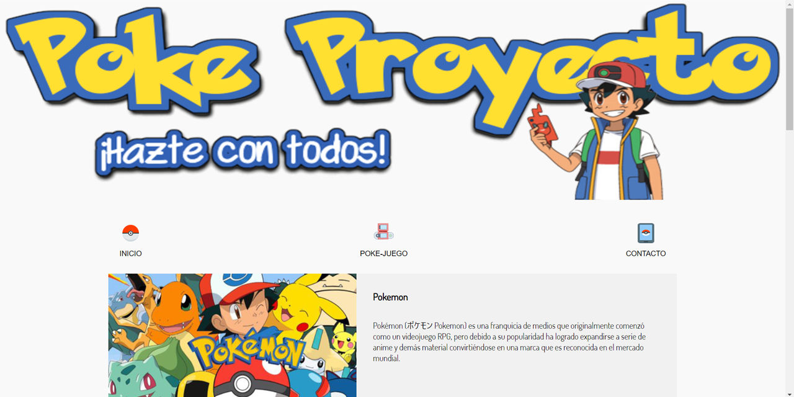

# GeeksHubs-P2--PokeProyecto
Este proyecto consiste en una pagina web de Pokemon, en la cual hago una breve introducción de Pokemon, que es pokemon, 
los videojuegos de pokemon, y pokemon el anime.

## Tecnologías que he utilizado 🛠️

>Mi pagina de Pokemon esta creada con HTML5 + API HTML5, CSS3,Layout ( Flex ), Responsive Design y
JavaScript.

### Demo del proyecto 

Puedes ver el proyecto en https://sofiapinilla.github.io/GeeksHubs-P2--PokeProyecto/ .

#### Preview
  .
---
Hecho por [Sofía Pinilla](https://github.com/SofiaPinilla) 😊
